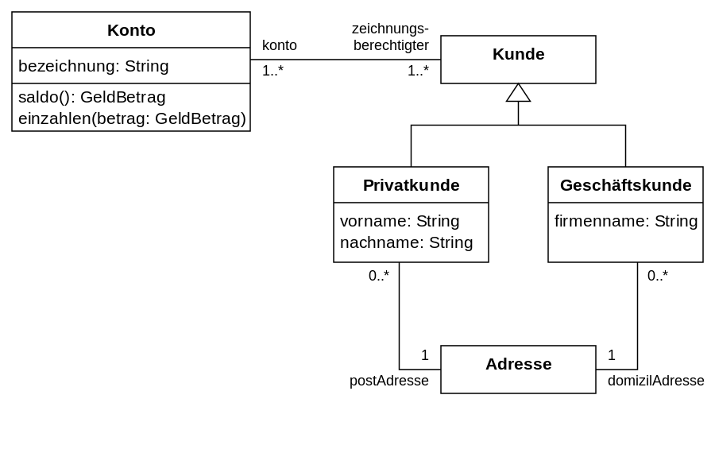

# ITP-Zusammenfassung
## Activity Diagram ACD

### Bauteile
- Swimlane
- Start & Endpunkt
- Aktionen (Subjekt + Prädikat)
- Pfeile 
- Paralelle Abläufe (Split & Join)
- Aufsplittungen (Ifs mit Guards)

## Use Case Diagram UCD

### Bauteile
- System (Rechteck mit Name)
- Strichmanschgal (Usergruppe)
- Feature (Subjekt + Prädikat)
- Ableitung (include)
- Vererbung (Kunden)

## Component Diagram CPD

### Bauteile
- APIs (Komponenten)
- Dienst anbieten (Lolipop)
- Dienst beanspruchen (nimmt Lolipop)

## Deployment Diagram DPD 

### Bauteile
- Reele Maschinen (Würfel)
- Verbindung zwischen diesen (Linie mit Name)
- Deployments 
- Komponente (Gleich wie bei CPD)
- Anleitungen (Falls nötig neben dem Deploy) *!!!Wie geht des?!!!*

## Class Diagram CLD

### Bauteile 
- Klassen
- Klassendiattribute
    - -private
    - +public
- Klassenmethoden
- Association (Linie)
    - "*" beliebig
    - "1" genau eins
    - 0.1 eins oder keins
-  Vererbung (großer Pfeil)
- Kommposition 
- Aggregation

 